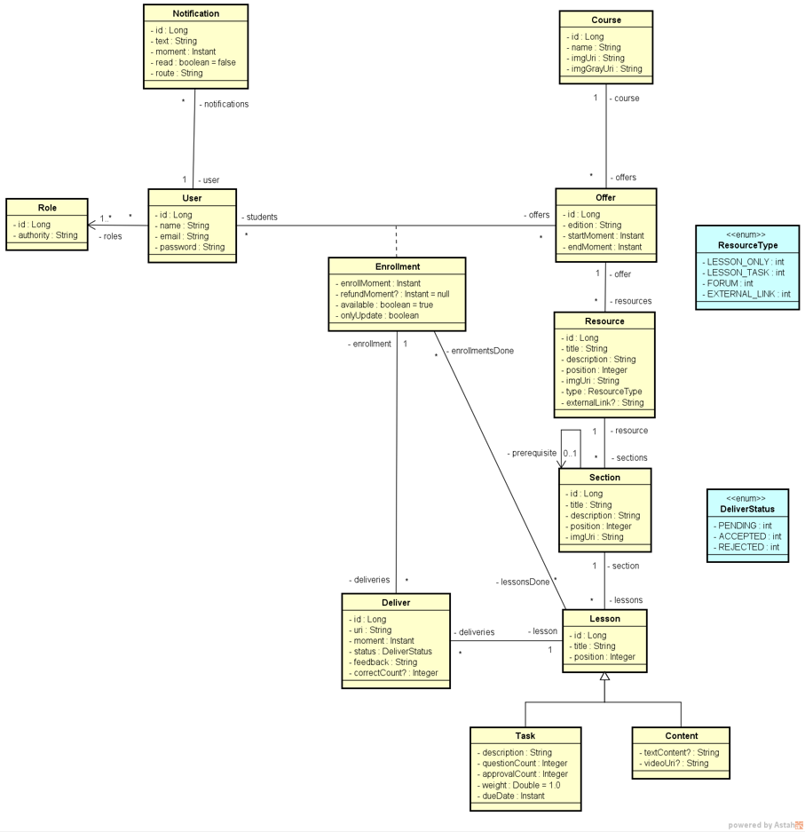
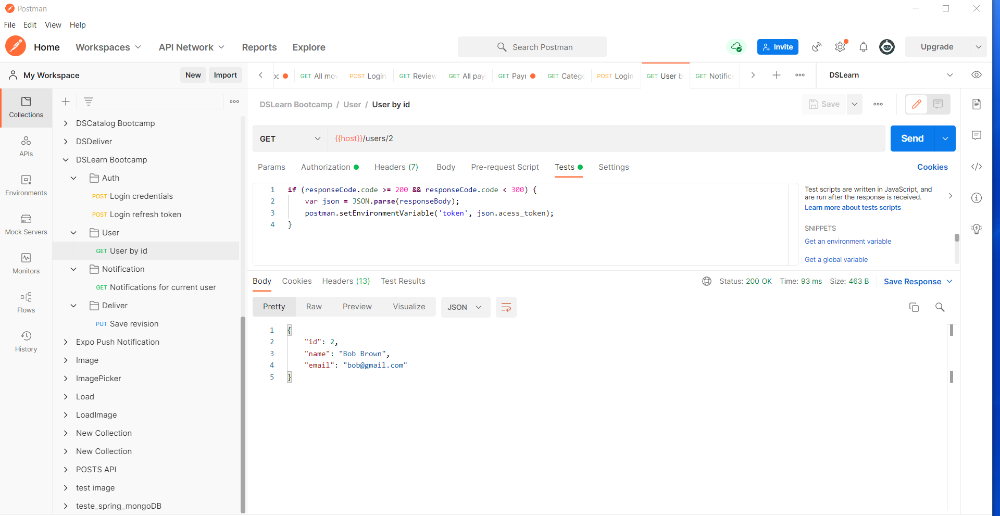

# bds-dslearn

## Sobre

Este é um projeto desenvolvido através do bootcamp devsuperior.

Projeto DSLearn

Competências

Implementação de um modelo conceitual (modelo de domínio em nível de análise)
Instanciação (seed) de um modelo de domínio com SQL
Reaproveitar “caixas de ferramentas” de projetos anteriores
Incluir segurança com OAuth2 e JWT
Incluir suporte a validação de dados com Bean Validation
Incluir tratamento de exceções
Realizar novas implementações de segurança
Autorização customizada em nível de serviço
Conteúdo customizado para o usuário logado
Refresh token
Pré-autorização de métodos
Padrão de projeto observer / princípio SOLID OCP
 
## Informações adicionais

Este projeto esta em fase de construção, ainda será implementado todo o front-end do projeto.

 
## Layout

  
  

